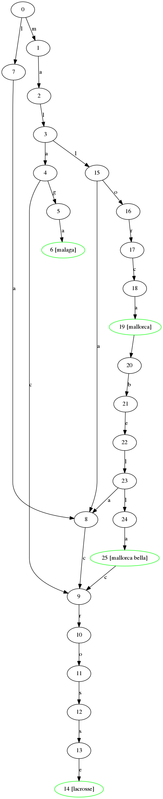

[](https://gitlab.com/evprocessing/ahocorapy/commits/master)
[](https://gitlab.com/evprocessing/ahocorapy/commits/master)

# ahocorapy - Fast Many-Keyword Search in Pure Python

ahocorapy is a pure python implementation of the Aho-Corasick Algorithm.
Given a list of keywords one can check if at least one of the keywords exist in a given text in linear time.

## Comparison:

### Why another Aho-Corasick implementation?

We started working on this in the beginning of 2016. Our requirements included unicode support combined with python2.7. That
was impossible with C-extension based libraries (like [pyahocorasick](https://github.com/WojciechMula/pyahocorasick/)). Pure 
python libraries were very slow or unusable due to memory explosion. Since then another pure python library was released 
[py-aho-corasick](https://github.com/JanFan/py-aho-corasick). The repository also contains some discussion about different
implementations. 
There is also [acora](https://github.com/scoder/acora), but it includes the note ('current construction algorithm is not 
suitable for really large sets of keywords') which really was the case the last time I tested, because RAM ran out quickly.

### Differences

- Compared to [pyahocorasick](https://github.com/WojciechMula/pyahocorasick/) our library supports unicode in python 2.7 just like [py-aho-corasick](https://github.com/JanFan/py-aho-corasick).
We don't use any C-Extension so the library is not platform dependant. 

- We don't look for multiple results, we are okay with finding only one. We might extend this in the future. 
For our use cases that was sufficient and helps with performance.

- On top of the standard Aho-Corasick longest suffix search, we also perform a shortcutting routine in the end, so
that our lookup is fast while, the setup takes longer. During set up we go through the states and directly add transitions that are
"offered" by the longest suffix or their longest suffixes. This leads to faster lookup times, because in the end we only have to
follow simple transitions and don't have to perform any additional suffix lookup. It also leads to a bigger memory footprint,
because the number of transitions is higher, because they are all included explicitely and not implicitely hidden by suffix pointers.

- We added a small tool that helps you visualize the resulting graph. This may help understanding the algorithm, if you'd like. See below.

### Performance

I compared the two libraries mentioned above with ahocorapy. We used 50,000 keywords long list and an input text of 34,199 characters.
In the text only one keyword of the list is contained.
The setup process was run once per library and the setup process was run 100 times. The following results are in seconds (not averaged for the lookup).

You can perform this test yourself using `python tests/ahocorapy_performance_test.py`.

These are the results:

```
----------ahocorapy----------
setup_ahocorapy: 2.756227495003259
search_ahocorapy: 2.2842286950035486
----------pyahocorasick----------
setup_pyahocorasick: 0.12347752699861303
search_pyahocorasick: 0.06832410101196729
----------py_aho_corasick----------
setup_py_aho_corasick: 2.372840342024574
search_py_aho_corasick: 16.12931612698594
```

As expected the C-Extension shatters the pure python implementations. Even though there is probably still room for optimization in
ahocorapy we are not going to get to the mark that pyahocorasick sets. Our lookups are faster than py_aho_corasick though, but that
can also vary depending on how the data is structured (both keywords and input text).


## Basic Usage:

### Creation of the Search Tree

```python
kwtree = KeywordTree(case_insensitive=True)
kwtree.add('malaga')
kwtree.add('lacrosse')
kwtree.add('mallorca')
kwtree.add('mallorca bella')
kwtree.finalize()
```

### Searching

```python
result = kwtree.search('My favorite islands are malaga and sylt.')
print result
```

Prints :
```python
('malaga', 24)
```

The search method always returns the first keyword found, or None if there is none.

```python
result = kwtree.search('crossing on mallorca bella')
print result
```

Prints :
```python
('mallorca', 12)
```
and not 'mallorca bella'. Since 'mallorca' is a strict prefix of it.

## Drawing Graph

You can print the underlying graph with the Visualizer class.
This feature requires a working pygraphviz library installed.

```python
from ahocorapy_visualizer.visualizer import Visualizer
visualizer = Visualizer()
visualizer.draw('readme_example.png', kwtree)
```

The resulting .png of the graph looks like this: 



